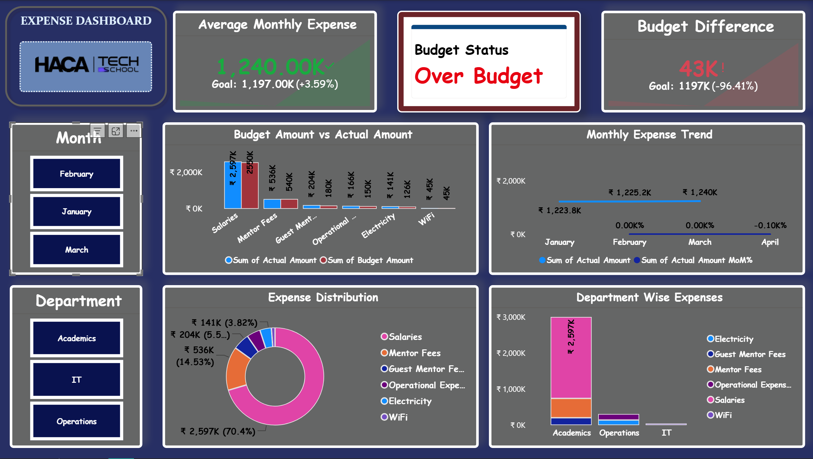

# ATP Tennis Rankings Analysis Dashboard

**Overview**
A Power BI dashboard for exploring ATP player rankings, historical ranking performance, player profiles, and country representation.

**Business objective**
Help tennis analysts and fans compare player ranking performance over time and identify patterns by country and playing hand.

**Key KPIs and metrics**
World No. 1, total players, countries represented, best ranking, ranking position, average ranking, and earliest available date.

**Dashboard features**
KPI cards, country/hand/player filters, year analysis, ranking trend visuals, bar charts, donut charts, and player-level comparisons.

**Insights and use cases**
Supports ranking-history analysis, player comparisons, country representation analysis, and exploration of ranking trends across years.

**Tools and technologies**
Power BI; calculated measures; interactive slicers and visualizations.

**Skills demonstrated**
Sports data analysis, KPI design, time-series analysis, segmentation, dashboard design, and data storytelling.

## Dashboard Screenshot

